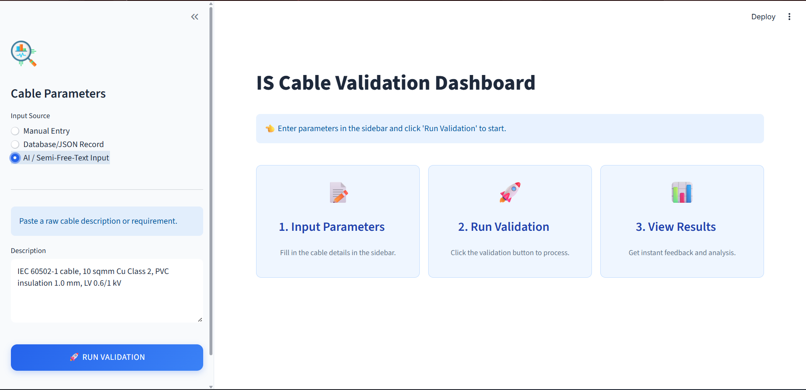

# 🔌 Cable Design Validation System UI


A modern, responsive dashboard for validating cable technical designs against international standards (e.g., IS 1554-1). This application serves as the user interface for the Cable Design Validation System, providing engineers with real-time feedback, confidence scores, and detailed compliance analysis.

---

## 🚀 Features

-   **Multiple Input Methods**:
    -   **Manual Entry**: Form-based input for standard parameters (Voltage, Conductor, Insulation, etc.).
    -   **Database/JSON Record**: Simulate fetching structured records for validation.
    -   **AI / Semi-Free-Text**: Natural language processing for unstructured cable descriptions.
-   **Real-time Validation**: Connects to a backend API to validate designs against specified standards.
-   **Smart Analysis**:
    -   **Confidence Scoring**: AI-driven confidence assessment of the validation result.
    -   **Detailed Breakdown**: Line-by-line compliance assertions (Pass/Fail/Review).
    -   **Visual Feedback**: Color-coded status indicators and meaningful icons.
-   **Modern UI**: Built with Streamlit and custom CSS styling for a clean, professional, and accessible experience.

## 🛠️ Technology Stack

-   **Frontend Framework**: [Streamlit](https://streamlit.io/)
-   **Language**: Python 3.10+
-   **HTTP Client**: `requests`
-   **Data Handling**: `pandas`, `pydantic`
-   **Package Management**: `uv` (recommended) or `pip`

## 📋 Prerequisites

Before running the application, ensure you have the following installed:

1.  **Python 3.10** or higher.
2.  **Backend Service**: This UI requires the accompanying FastAPI backend service to be running at `http://127.0.0.1:8000` (by default).
3.  **uv** (Optional but recommended for fast package management):
    ```powershell
    pip install uv
    ```

## 📦 Installation & Setup

### Option 1: Quick Start (Windows)

We have provided a convenient batch script for Windows users.

1.  Double-click `run.bat` or execute it in your terminal:
    ```powershell
    .\run.bat
    ```
    *This script requires [uv](https://github.com/astral-sh/uv) to be installed. It will automatically create a virtual environment, install dependencies, and launch the app.*

### Option 2: Manual Installation

1.  **Clone the repository:**
    ```bash
    git clone <repository-url>
    cd Cable-design-validation-system-UI
    ```

2.  **Create a virtual environment:**
    ```bash
    # Using python directly
    python -m venv .venv
    
    # OR using uv (faster)
    uv venv
    ```

3.  **Activate the environment:**
    -   Windows: `.venv\Scripts\activate`
    -   Mac/Linux: `source .venv/bin/activate`

4.  **Install dependencies:**
    ```bash
    # Standard pip
    pip install -r requirements.txt
    
    # OR using uv
    uv pip install -r requirements.txt
    ```

## 🖥️ Usage

1.  **Start the Application:**
    If you didn't use `run.bat`, run the following command:
    ```bash
    streamlit run app.py
    ```

2.  **Navigate the Interface:**
    -   **Sidebar**: Select your input source (Manual, JSON, or Free-Text) and enter the cable parameters.
    -   **Run Validation**: Click the "🚀 Run Validation" button to send the data to the backend API.
    -   **View Results**: The main dashboard will display the confidence score, key metrics, and a detailed table of validation steps.

## 🖼️ UI Preview



*The application features a clean, modern interface with a 3-step workflow: Input Parameters → Run Validation → View Results*


## 📂 Project Structure

```text
Cable-design-validation-system-UI/
├── .streamlit/          # Streamlit configuration
├── assets/              # Static assets (images, icons)
├── src/                 # Source code
│   ├── api_service.py   # API client for backend communication
│   └── styles.py        # Custom CSS and branding logic
├── app.py               # Main Streamlit application entry point
├── requirements.txt     # Python dependencies
├── run.bat              # Windows automated run script
└── README.md            # Project documentation
```

## ⚙️ Configuration

The API connection allows for configuration in `src/api_service.py`.
By default, it points to:
```python
base_url="http://127.0.0.1:8000"
```
Modify this value if your backend service is hosted on a different port or server.

## 🚀 Deployment

### Streamlit Cloud (Recommended)

This repository is optimized for deployment on **Streamlit Cloud**:

1.  Push your code to GitHub.
2.  Log in to [Streamlit Cloud](https://streamlit.io/cloud).
3.  Click **New app** and select this repository (`Cable-design-validation-system-UI`).
4.  Set the main file path to `app.py`.
5.  Click **Deploy**.

*The CI/CD pipeline configured in `.github/workflows/ci_cd.yml` will automatically test your code on every push to ensure stability.*

## 🤝 Contributing

Contributions are welcome! Please fork the repository and submit a pull request for any improvements or bug fixes.

## 📄 License

This project is licensed under the MIT License - see the LICENSE file for details.
